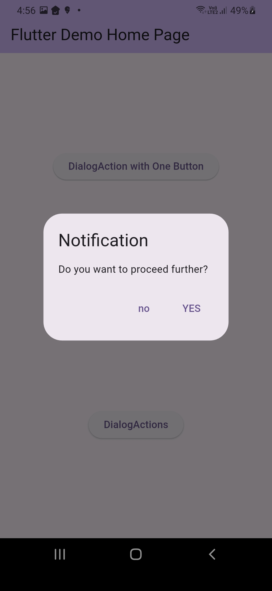
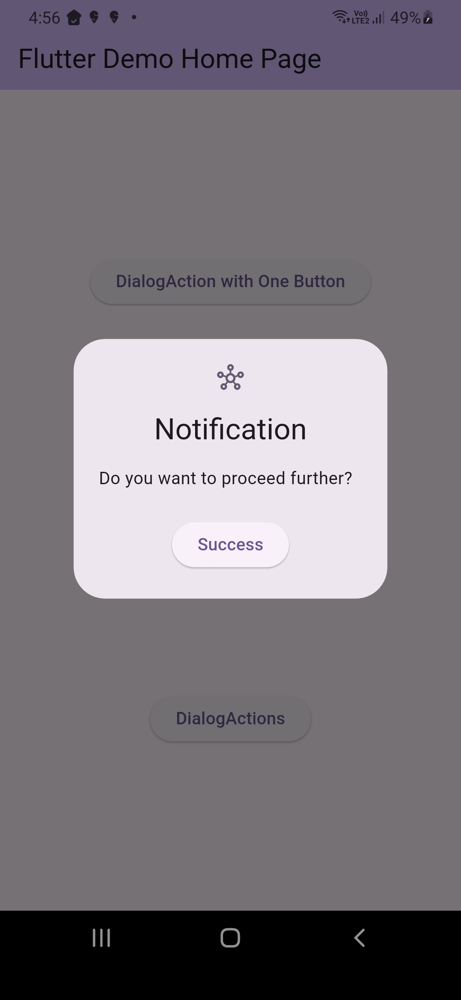

# 🚨 alert_box_plus

A customizable, modern-looking alert dialog package for Flutter.  
`alert_box_plus` helps you show consistent, simple alert boxes with minimal code — perfect for quick notifications, confirmations, and messages in both light and dark themes.

[](https://pub.dev/packages/alert_box_plus)
[](https://github.com/satyaroutray1/alert_box_plus)
[](LICENSE)

---

## ✨ Features

- ✅ Simple syntax for showing alert dialogs
- 🎨 Customizable title, message, button colors
- 🌙 Works with dark mode
- 🔄 Supports single or dual action buttons

---

<p align="center">
  
  
</p>

---

## 🚀 Installation

Add this to your `pubspec.yaml`:

```yaml
dependencies:
  alert_box_plus: ^0.0.1

Then run:
    flutter pub get


---
🙌 Author

Built with ❤️ by 🌐 [Satya Routray](satya-routray.web.app)
